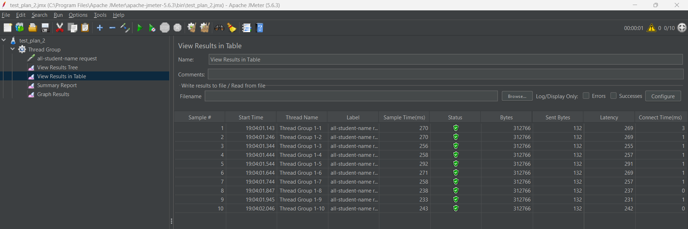
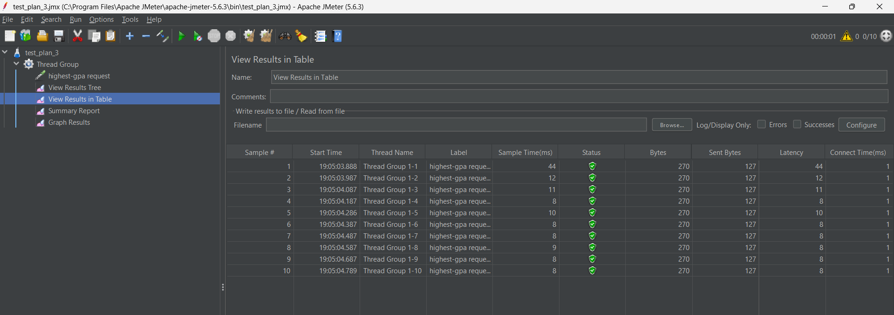

Tutorial 5

Before Optimize

in JMeter

all-student

all-student-name

highest-gpa

JMeter from command line

all-student

all-student-name

highest-gpa

After Optimization

all-student

all-student-name

highest-gpa

Conclusion: setelah melakukan performance optimization, processing time dari masing-masing method menjadi lebih cepat saat 
dijalankan. Terlihat pada gambar JMeter test di atas, performance testing yang dilakukan menunjukkan peningkatan performa 
yang ditandai dengan pengurangan waktu

Please answer the following questions:
1. What is the difference between the approach of performance testing with JMeter and
profiling with IntelliJ Profiler in the context of optimizing application performance?

JMeter digunakan untuk menguji performa aplikasi dengan cara menyimulasikan skneario dimana terdapat banyak pengguna
yang mengakses aplikasi secara bersama-sama. Sedangkan, IntelliJ Profiler berguna untuk mengidentifikasi bagian dari kode 
aplikasi yang menyebabkan performa aplikasi menurun. IntelliJ menampilan berbagai macam metrik seperti CPU Usage dan kode yang
inefisien agar kita tahu apa yang menimbulkan masalah tersebut

2. How does the profiling process help you in identifying and understanding the weak points
   in your application?

Dengan melakukan profiling, saya dapat mengidentifikasi bagian kode yang inefisien. Kode yang inefisien ini membutuhkan 
execution time yang lama sehingga dapat menciptakan performance bottleneck. Profiling juga dapat menampilkan penggunaan memori
dalam aplikasi kita. Metrik-metrik yang ditampilkan ini dapat membantu dalam mengidentifikasi bagian kode mana yang membutuhkan
optimisasi

3. Do you think IntelliJ Profiler is effective in assisting you to analyze and identify
   bottlenecks in your application code?

Cukup efektif dengan karena saya mendapatkan informasi mengenai waktu yang dibutuhkan untuk mengeksekusi fungsi tertentu sehingga
saya dapat mengidentifikasi kode yang masih inefisien dalam kode saya

4. What are the main challenges you face when conducting performance testing and
   profiling, and how do you overcome these challenges?

Belajar menggunakan aplikasi baru seperti JMeter serta mencoba mengoptimisasi kode dalam
Spring Framework. Saya mengatasinya dengan cara banyak membaca dokumentasi di internet serta membaca modul
dengan lebih teliti

5. What are the main benefits you gain from using IntelliJ Profiler for profiling your
   application code?

IntelliJ Profiler memberi saya banyak data untuk menganailis metode yang ada dalam kode saya. IntelliJ
juga memberikan data execution time untuk semua method yang ada sehingga saya dapat mencari tahu method mana
yang bermasalah

6. How do you handle situations where the results from profiling with IntelliJ Profiler are not entirely consistent with findings from performance testing using JMeter?

Saya belum mengalami kasus tersebut selama mengerjakan tutorial ini. Namun, saya pasti akan memastikan bahwa konfiguras
pada kedua aplikasi tersebut sudah benar atau belum. Jika tidak ditemukan, saya juga akan mencoba mengulang melakukan profiling dan performance testing untuk 
memastikan tidak ada masalah dalam hardware atau koneksi internet saya. Terakhir, saya akan mencoba mencar referensi
di internet atau bertanya kepada dosen atau asdos

7. What strategies do you implement in optimizing application code after analyzing results
   from performance testing and profiling? How do you ensure the changes you make do
   not affect the application's functionality?

Pertama, mengidentifikasi method yang tidak efisien. Kemudian, method tersebut akan saya refactor dengan cara mengganti algoritma atau
struktur data agar lebih efisien. Terakhir saya melakukan testing dan profiling kembali untuk memastikan aplikasi tidak bermasalah
setelah melakukan refactoring. Unit test juga bisa ditambahkan dalam kode untuk mengautomasi proses testing method yang di refactor

